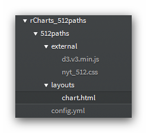

## NY Times [512 Paths to the White House](http://www.nytimes.com/interactive/2012/11/02/us/politics/paths-to-the-white-house.html?_r=1&)
## Recreated in [R](http://r-project.org) with [rCharts](http://ramnathv.github.io/rCharts) and [slidify](http://ramnathv.github.io/slidify)
<br/>
_ _ _
**I claim absolutely no credit for this visualization, which I consider one of the most instructive I have ever seen.  If anybody believes this to be not fair use, I will take it down immediately.**   
<br/>
- - -

Follow the steps below to go from the NYT feature to something we can render from R.  If you are lazy or impatient, you can just copy the 512paths directory from [Github](https://github.com/timelyportfolio/rCharts_512paths/tree/gh-pages/rCharts_512paths) into /PathToR/libraries/rCharts and skip past the steps.
<br/>
<br/>
### Steps to Accomplish
1.  In Path-to-R/library/rCharts/, **create a new directory 512paths**.  Within this new 512paths, set up two subdirectories: **external** and **layouts**.    
2.  **Save** [iframe.html](http://www.nytimes.com/newsgraphics/2012/10/12/electoral-calculator/7feadbc7606af9ce0e5d242e1ba75fd53717da7d/iframe.html) from the NYT **into the new 512paths/layouts directory from step 1**.  This isolates the visualization, so we can use it for our template.    
3.  **Rename iframe.html to chart.html**.    
3.  **Open chart.html** from step 2 in a text editor.    
4.  **Copy everything between the <style></style> tags** into a **new text file** that we will name **nyt_512.css** and **save in 512paths/external** created in step 1.    
4.  **Delete everything in chart.html** except for the portion    
    <pre>   
      div class="g-controls"    
      ...    
        function diagonal(d) {    
        var x0 = d.source.x, y0 = y(d.source.depth),    
            x1 = d.target.x, y1 = y(d.target.depth);    
        if (x0 < x1) x0 += w(d.target.probability) / 2;    
        else if (x0 > x1) x0 -= w(d.target.probability) / 2;    
        return "M" + x0 + "," + y0    
            + "C" + x0 + "," + (y0 + y1) / 2    
            + "," + x1 + "," + (y0 + y1) / 2    
            + "," + x1 + "," + y1;    
        }    
            
      })();    
      \<\/script\>
    </pre>
5.  Change the line
    <pre>
    d3.tsv("states.tsv", function(error, states) {    
    </pre>
    to    
    <pre>
    d3.tsv("http://timelyportfolio.github.io/rCharts_512paths/data/states.tsv", function(error, states) {    
    </pre>
5.  Save [d3.v3.min.js](http://d3js.org/d3.v3.min.js) into 512paths/external created in step 1.
6.  Create a new text file that we will call config.yml and save in the 512paths from step 1.
    <pre>  
    512paths:    
        css: [external/nyt_512.css]    
        jshead: [external/d3.v3.min.js]    
        cdn:    
          jshead:    
            - http://d3js.org/d3.v3.min.js
    </pre>
7.  Now is a good time to check your directory structure.  It should look like the picture below.    
  
8.  Run the following code in R.

```{r results='hide'}
#if you have not installed slidify, slidifyLibraries, or rCharts
#require(devtools)
#install_github('rCharts', 'slidify', ref = 'dev')
#install_github('rCharts', 'slidfyLibraries', ref = 'dev')
#install_github('rCharts', 'ramnathv')

require(rCharts)
#get data from downloaded NYT tsv and inject in through params
data <- read.delim(file = "data/states.tsv")
p1 <- rCharts$new()
p1$field( 'lib', '512paths' )
p1$set( data = toJSONArray( data ) )
p1
```

As a disclaimer, I made some unnecessary adjustments primarily for politeness.  The only changes to the code remove dependencies on NYT for the d3 and svg/png graphics.  Also, as an illustration of how we can do this, data is provided from R rather than the original d3.tsv method.  If you are interested in these changes, feel free to explore the [code](http://github.com/timelyportfolio/rCharts_512paths).

```{r results='asis',echo=FALSE,warnings=FALSE,message=FALSE}
p1$print( 'g-chart' )
```
